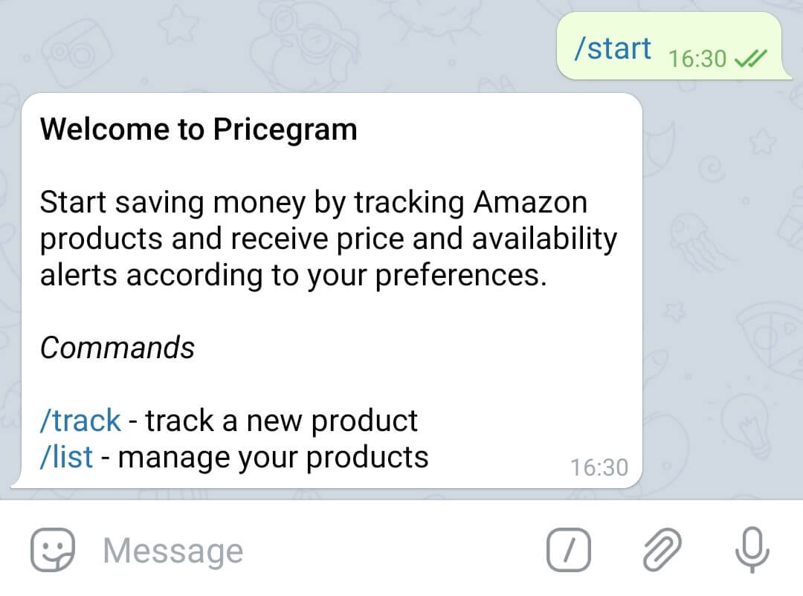
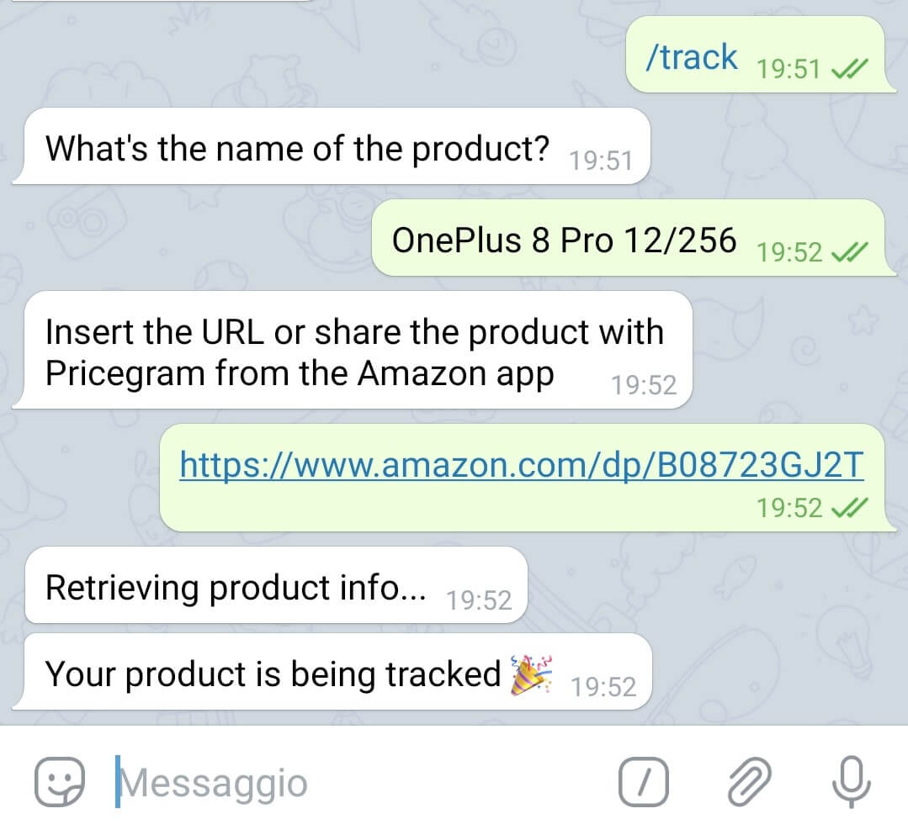
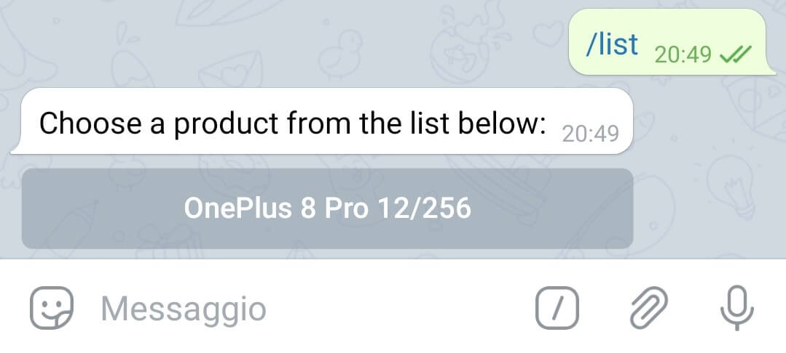
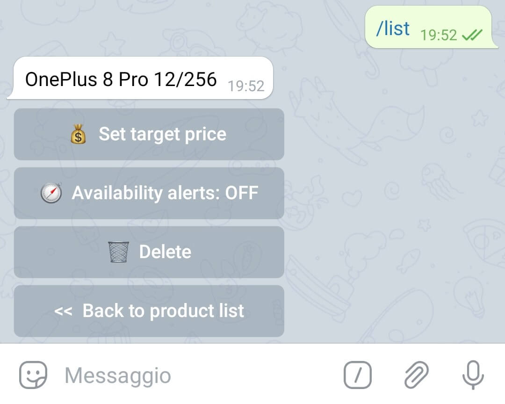
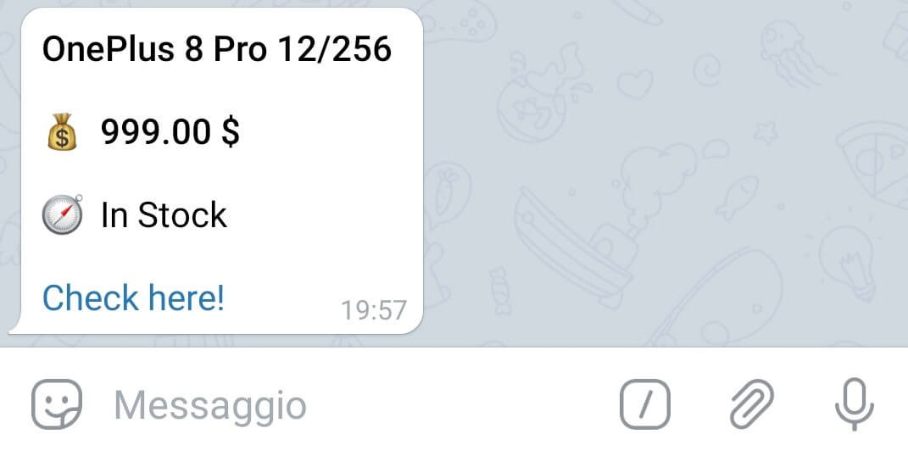

<p align="center">
  
</p>

<br>

Pricegram is a **price tracker** bot for **Telegram** that tracks **Amazon** products for price and availability changes and sends alerts according to user preferences.

Pricegram's default behaviour is to send **price alerts** every time the price of a product changes. However, it is possible to set the desired price for each product to only receive an alert when its price matches or goes below the desired one.

**Availability alerts** are turned off by default but can be enabled on a per-product basis to receive alerts every time its availability changes (e.g. the number of remaining units).

## Requirements

* MongoDB

## Installation

Pull the [Docker](https://www.docker.com) image from [DockerHub](https://hub.docker.com/):

```
docker pull aleg94/pricegram
```

Run the image in a container providing the following *environment variables*:

* `MONGO_CONNECTION_URI`: the [URI](https://docs.mongodb.com/manual/reference/connection-string/) connection string for MongoDB
* `TELEGRAM_BOT_TOKEN`: the access token of the Telegram bot

<br>

```
docker run --name pricegram -d 
  -e MONGO_CONNECTION_URI=<mongo-uri> 
  -e TELEGRAM_BOT_TOKEN=<bot-token>
  aleg94/pricegram
```

## Usage

Upon start, the bot presents a welcome message with a brief explanation of the functionalities and the list of available commands to interact with it.

<br>
<p align="center">
  
</p>

<!-- ### Commands -->

### /track

The *track* command can be used to **add a new product** to the list of tracked ones. It will ask the user to choose a name for the product and provide a reference to it either by sending its URL or sharing it with Pricegram from the Amazon App.

<br>
<p align="center">
  
</p>


### /list

The *list* command can be used to **manage products** that are currently being tracked. After selecting a product from the list, a menu can be used to:

* Set the **target price**
* Enable or disable **availability alerts**
* **Delete** the product

<br>
<p align="center">
  
  
</p>

## Alerts

Whenever the price or availability of a product changes, an alert is sent according to user preferences. The alert contains a hyperlink to the product page.

<br>
<p align="center">
  
</p>

## Notes

Prices and availabilities of products are updated about every 90 minutes to avoid spamming Amazon servers.

Pricegram is currently compatible with products sold in the following currencies: `USD`, `GBP`, `EUR`, `BRL`, `RUB`, `ILS`, `RON`.

